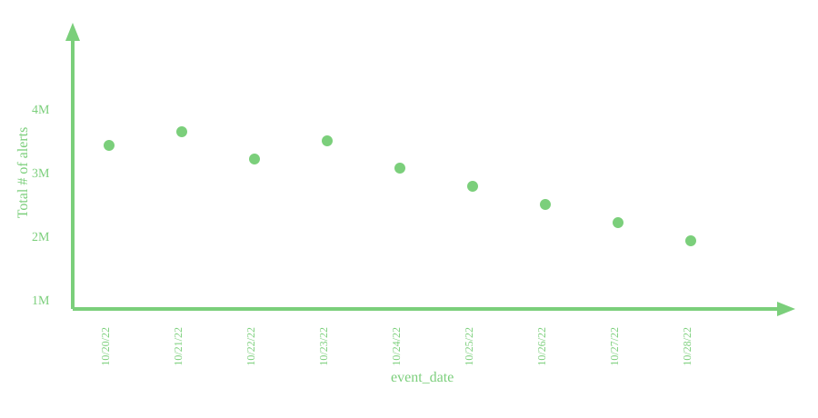
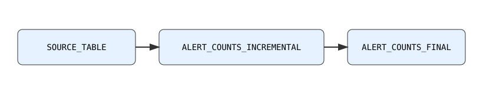

<br>
<br>

I will kickstart my blogging journey by distilling one very important concept -- incrementally processing "late-arriving data" -- from ["Functional Data Engineering -- a modern paradigm for batch data processing"](https://maximebeauchemin.medium.com/functional-data-engineering-a-modern-paradigm-for-batch-data-processing-2327ec32c42a), perhaps the most popular Data Engineering blogpost of all time.

"Late-arriving" data is inherent to Internet of Things (IOT) systems. Edge devices often temporarily lose connection to a central server -- while the data stream is interrupted, the device can continue recording and buffering data. The Cloud Data Platform team at Tesla (named Fleet Analytics during my tenure at Tesla), digests massive amounts of data and a good portion of that data is "late-arriving" as millions of Tesla vehicles have intermittent cellular / WiFi connection and consequentially intermittent connection to Tesla's cloud. **Big data needs to be processed as soon as data arrives but should not be reprocessed.** The strategy to incrementally process "late-arriving" data, detailed below, was heavily evangelized by the Fleet Analytics team.

<h2>Problem Statement</h2>
Assume we want to track the total number of alerts of our fleet over time -- ensure it is trending down and we are alerted to any spikes. How can we do so with minimal resources (i.e. reprocessing of data) and minimal latency?
<br>
<br>



<h2>Data Pipeline</h2>

In general, it is critical to dissociate *event timestamp* (when event occured or measurement was made), *received timestamp* (when record was ingested to cloud), and *processing timestamp* (when record was processed in data pipeline). As mentioned in IOT systems, there can be a significant lag between *event timestamp* and *received timestamp*. For illustrative purposes we will only deal with date format and assume `received_date` and `processing_date` are always equal. 
<br>

<!-- https://www.reddit.com/r/vscode/comments/1ibntfy/svg_files_open_as_previews_i_want_them_to_open_as/ -->


<br>
<br>

<h3>SOURCE_TABLE &rarr; ALERT_COUNTS_INCREMENTAL</h3>
<br>

<table>
<caption style="font-weight: bold;">SOURCE_TABLE</caption>
  <thead>
    <tr>
      <th>event_date</th>
      <th>received_date</th>
      <th>alert</th>
      <th>VIN</th>
    </tr>
  </thead>
  <tbody>
    <tr style="color: green;"><td>2000-01-01</td><td>2001-01-01</td><td>P0171</td><td>JA4AZ2A38JJ600754</td></tr>
    <tr style="color: green;"><td>2000-01-01</td><td>2001-01-01</td><td>P0340</td><td>1FMCU9DG9CKA65334</td></tr>
    <tr style="color: orange;"><td>2000-01-01</td><td>2001-01-02</td><td>P0300</td><td>1GTS7D4Y9FV510290</td></tr>
    <tr style="color: orange;"><td>2000-01-02</td><td>2001-01-02</td><td>P0171</td><td>JA4AZ2A38JJ600754</td></tr>
    <tr style="color: blue;"><td>2000-01-03</td><td>2001-01-03</td><td>P0340</td><td>1FMCU9DG9CKA65334</td></tr>
  </tbody>
  <caption style="caption-side: bottom;font-size: small;">Record colors reflect partitioning on received_date.</caption>
</table>
<br>

Every day, extract data from SOURCE_TABLE for previous `received_date`, and compute counts of alert for each `event_date`. Said differently, on each day we will compute the incremental alert counts for each `event_date`.
<br>

```sql
INSERT INTO ALERT_COUNTS_INCREMENTAL
SELECT received_date, event_date, COUNT(*) AS alerts_count
FROM SOURCE_TABLE
WHERE received_date = @YESTERDAY
GROUP BY received_date, event_date
```
We filter on `received_date`, leveraging the partition by `received_date` in SOURCE_TABLE.
<br>
<br>

<table>
<caption style="font-weight: bold;">ALERT_COUNTS_INCREMENTAL</caption>
  <thead>
    <tr>
      <th>event_date</th>
      <th>received_date</th>
      <th>alerts_count</th>
    </tr>
  </thead>
  <tbody>
    <tr style="color: green;"><td>2000-01-01</td><td>2001-01-01</td><td>2</td></tr>
    <tr style="color: orange;"><td>2000-01-01</td><td>2001-01-02</td><td>1</td></tr>
    <tr style="color: orange;"><td>2000-01-02</td><td>2001-01-02</td><td>1</td></tr>
    <tr style="color: blue;"><td>2000-01-03</td><td>2001-01-03</td><td>1</td></tr>
  </tbody>
    <caption style="caption-side: bottom;font-size: small;">Record colors reflect partitioning on received_date.</caption>
</table>

Never append, always insert overwrite (Idempotence). When inserting incremental results into ALERT_COUNTS_INCREMENTAL, insert overwrite the whole `received_date` partition each time. This will make sure that the pipeline can be re-run or backfilled without fear of inserting duplicates into ALERT_COUNTS_INCREMENTAL.
<br>
<br>
<br>
<h3>ALERT_COUNTS_INCREMENTAL &rarr; ALERT_COUNTS_FINAL </h3>
<br>
Finally, query incremental table to recover final total number of alerts, for our dashboard. This step will process all the results/rows from the incremental table each time it is run, but this table is many orders of magnitude smaller than the source table.
<br>
<br>

```sql
INSERT INTO ALERT_COUNTS_FINAL
SELECT event_date, SUM(alerts_count) AS total_alerts_count
FROM ALERT_COUNTS_INCREMENTAL
GROUP BY event_date
```
<br>

<table>
<caption>ALERT_COUNTS_FINAL</caption>
  <thead>
    <tr>
      <th>event_date</th>
      <th>total_alerts_count</th>
    </tr>
  </thead>
  <tbody>
    <tr><td>2000-01-01</td><td>3</td></tr>
    <tr><td>2000-01-02</td><td>1</td></tr>
    <tr><td>2000-01-03</td><td>1</td></tr>
  </tbody>
</table>
<br>
<br>

<h2>Further Optimization</h2>
The key optimization utilized in the data pipeline is to partition data on received/processing dates, rather than event date. There are further optimizations one can perform that are discussed in the parent blog and linked below. However, these optimizations are coupled to the particular data model and database technologies one will use in their pipeline. 
<br>
<br>

https://maximebeauchemin.medium.com/functional-data-engineering-a-modern-paradigm-for-batch-data-processing-2327ec32c42a#:~:text=Late%20arriving%20facts.