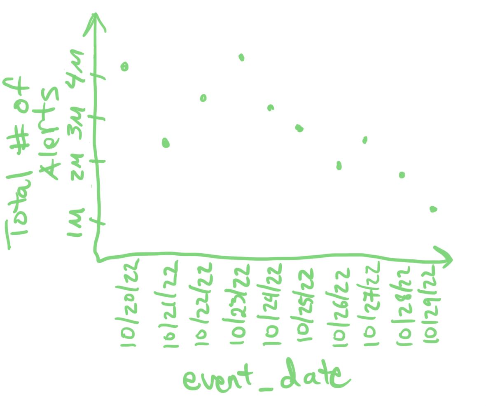

I will kickstart my blogging journey by distilling a very important concept from perhaps the most popular Data Engineering blogpost of all time, ["Functional Data Engineering -- a modern paradigm for batch data processing"](https://maximebeauchemin.medium.com/functional-data-engineering-a-modern-paradigm-for-batch-data-processing-2327ec32c42a). That is the concept of incrementally processing "late-arriving data". 

"Late-arriving" data is very common in Internet of Things (IOT) systems. Edge devices often temporarily lose connection to a central server -- while the data stream is interrupted the device can continue recording data. The Cloud data platform team at Tesla (named Fleet Analytics at the time I worked there), digests massive amounts of data and a good portion of that data is "late-arriving" as millions of Tesla vehicles have intermittent connection to Tesla's cloud. **Big data needs to be processed as soon as data arrives but should not be reprocessed.** The strategy to incrementally process "late-arriving" data, detailed below, was heavily evangelized by the Fleet Analytics team.

It is critical to dissociate *event timestamp* (when event occured or measuremment was made), *received timestamp* (when record was ingested to cloud), and *processing timestamp* (when record was processed in data pipeline). As mentioned in IOT systems, there can be a significant lag between event timestamp and received timestamp. For illustrative purposes we will only deal with date format and assume received date and processing date are always equal. 

<h2>Problem Statement</h2>
Assume we want to track the total number of alerts of our fleet over time -- ensure it is trending down and we are alerted to any spikes.



<h2>Data Pipeline</h2>

**SOURCE_TABLE &rarr; ALERT_COUNTS_INCREMENTAL &rarr; ALERT_COUNTS_FINAL**

<table>
<caption>SOURCE_TABLE</caption>
  <thead>
    <tr>
      <th>event_date</th>
      <th>received_date</th>
      <th>alert</th>
      <th>VIN</th>
    </tr>
  </thead>
  <tbody>
    <tr style="color: green;"><td>2000-01-01</td><td>2001-01-01</td><td>P0171</td><td>JA4AZ2A38JJ600754</td></tr>
    <tr style="color: orange;"><td>2000-01-01</td><td>2001-01-02</td><td>P0300</td><td>1GTS7D4Y9FV510290</td></tr>
    <tr style="color: orange;"><td>2000-01-02</td><td>2001-01-02</td><td>P0171</td><td>JA4AZ2A38JJ600754</td></tr>
    <tr style="color: blue;"><td>2000-01-03</td><td>2001-01-03</td><td>P0340</td><td>1FMCU9DG9CKA65334</td></tr>
  </tbody>
</table>

It is critical that the top level partition for the source table is `received_date`

SOURCE_TABLE &rarr; ALERT_COUNTS_INCREMENTAL <br>
Every day, extract data from SOURCE_TABLE for previous `received_date`, and compute counts of alert for each `event_date`. Said differently, on each day we will compute the incremental alert counts for each `event_date`.

```sql
INSERT INTO ALERT_COUNTS_INCREMENTAL
SELECT received_date, event_date, COUNT(*) AS alerts_count
FROM SOURCE_TABLE
WHERE received_date = @YESTERDAY
GROUP BY received_date, event_date
```
We filter on `received_date`, which is why it was critical to partition by `received_date` in SOURCE_TABLE.