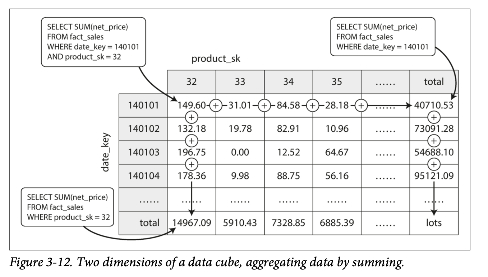

<br>
<br>

Data warehouses (OLAP databases) are used for many *write-once, read-many* aggregate (`COUNT`, `SUM`, `AVG`, `MIN`, or `MAX`) workloads. But, it is wasteful to crunch through common aggregations for every user's query. Futhermore, it may not be prudent to allow all readers to spin up huge clusters to perform expensive queries. Instead, these common query results should be calculated once, persisted, and available to all readers. One way to persist the data results, which is native to the data warehouse, is with a `MATERIALIZED VIEW`. As opposed to a standard (virtual) `VIEW`, which is simply a shortcup / wrapper over a longer SQL query, a `MATERIALIZED VIEW` is an actual copy of the underlying query results, written to disk. When the underlying data changes, a materialized view needs to be refreshed.

```sql
CREATE MATERIALIZED VIEW mv AS SELECT * FROM my_table;
REFRESH MATERIALIZED VIEW mv;
```

A common special case of a `MATERIALIZED VIEW` is known as a **Data Cube** or **OLAP Cube**: grid of aggregates over an underlying fact table grouped by different dimensions.

<figcaption style="font-size: small;">Figure above from "Designing Data-Intensive Applications"</figcaption>

In general, facts often have more than two dimensions (e.g. five dimensions such as date, product, store, promotion, and customer). It’s a lot harder to imagine what a five-dimensional hypercube would look like, but the principle remains the same: each cell contains the sales for a particular date-product-store-promotion-customer combination.
<br>
<br>
<h2> Example 1</h2>

`GROUPING SETS`, `CUBE`, and `ROLLUP` are special syntax that extend the capabilities of `GROUP BY` and are often available in OLAP Database Management Systems (DBMS). It is best to illustrate the usefuleness of these keywords with a clear example; and, more specifically, show how `CUBE` can be used to create a *data cube*.

Consider the fact table:
<details style="border: 1px solid #ccc; padding: 10px; margin: 5px; border-radius: 5px;">
<summary>Show dbo.fact_sales</summary>
<table>
  <thead>
    <tr>
      <th>sale_year</th>
      <th>store</th>
      <th>product</th>
      <th>quantity</th>
    </tr>
  </thead>
  <tbody>
    <!-- 2024 -->
    <tr><td>2024</td><td>Starbucks</td><td>Coffee</td><td>10</td></tr>
    <tr><td>2024</td><td>Starbucks</td><td>Pastries</td><td>5</td></tr>
    <tr><td>2024</td><td>Starbucks</td><td>Sandwich</td><td>6</td></tr>
    <tr><td>2024</td><td>Starbucks</td><td>Juice</td><td>2</td></tr>
    <tr><td>2024</td><td>Peets</td><td>Coffee</td><td>3</td></tr>
    <tr><td>2024</td><td>Peets</td><td>Pastries</td><td>3</td></tr>
    <tr><td>2024</td><td>Peets</td><td>Sandwich</td><td>2</td></tr>
    <tr><td>2024</td><td>Peets</td><td>Juice</td><td>1</td></tr>
    <tr><td>2024</td><td>Dunkin</td><td>Coffee</td><td>8</td></tr>
    <tr><td>2024</td><td>Dunkin</td><td>Pastries</td><td>6</td></tr>
    <tr><td>2024</td><td>Dunkin</td><td>Sandwich</td><td>5</td></tr>
    <tr><td>2024</td><td>Dunkin</td><td>Juice</td><td>3</td></tr>
    <!-- 2023 -->
    <tr><td>2023</td><td>Starbucks</td><td>Coffee</td><td>8</td></tr>
    <tr><td>2023</td><td>Starbucks</td><td>Pastries</td><td>4</td></tr>
    <tr><td>2023</td><td>Starbucks</td><td>Sandwich</td><td>5</td></tr>
    <tr><td>2023</td><td>Starbucks</td><td>Juice</td><td>1</td></tr>
    <tr><td>2023</td><td>Peets</td><td>Coffee</td><td>2</td></tr>
    <tr><td>2023</td><td>Peets</td><td>Pastries</td><td>2</td></tr>
    <tr><td>2023</td><td>Peets</td><td>Sandwich</td><td>1</td></tr>
    <tr><td>2023</td><td>Peets</td><td>Juice</td><td>1</td></tr>
    <tr><td>2023</td><td>Dunkin</td><td>Coffee</td><td>6</td></tr>
    <tr><td>2023</td><td>Dunkin</td><td>Pastries</td><td>5</td></tr>
    <tr><td>2023</td><td>Dunkin</td><td>Sandwich</td><td>4</td></tr>
    <tr><td>2023</td><td>Dunkin</td><td>Juice</td><td>2</td></tr>
  </tbody>
</table>
</details>

<details style="border: 1px solid #ccc; padding: 10px; margin: 5px; border-radius: 5px;">
<summary><strong>GROUP BY</strong></summary>
<table>
  <thead>
    <tr>
      <th>year=2024</th>
      <th>dunkin</th>
      <th>peets</th>
      <th>starbucks</th>
      <th>total</th>
    </tr>
  </thead>
  <tbody>
    <tr>
      <th>coffee</th>
      <td style="background-color: yellow;">8</td>
      <td style="background-color: yellow;">3</td>
      <td style="background-color: yellow;">10</td>
      <td>21</td>
    </tr>
    <tr>
      <th>juice</th>
      <td style="background-color: yellow;">3</td>
      <td style="background-color: yellow;">1</td>
      <td style="background-color: yellow;">2</td>
      <td>6</td>
    </tr>
    <tr>
      <th>pastries</th>
      <td style="background-color: yellow;">6</td>
      <td style="background-color: yellow;">3</td>
      <td style="background-color: yellow;">5</td>
      <td>14</td>
    </tr>
    <tr>
      <th>sandwhich</th>
      <td style="background-color: yellow;">5</td>
      <td style="background-color: yellow;">2</td>
      <td style="background-color: yellow;">6</td>
      <td>13</td>
    </tr>
    <tr>
      <th>total</th>
      <td>22</td>
      <td>9</td>
      <td>23</td>
      <td>54</td>
    </tr>
  </tbody>
</table>

```sql
SELECT
    store_name,
    product,
    SUM(quantity) AS total
FROM dbo.fact_sales
WHERE sale_year = 2024
GROUP BY store_name, product;
```
or
```sql
SELECT
    store_name,
    product,
    SUM(quantity) AS total
FROM dbo.fact_sales
WHERE sale_year = 2024
GROUP BY GROUPING SETS (
  (store_name, product)--,
  --(product),
  --(store_name),
  --()
);
```
</details>

<details style="border: 1px solid #ccc; padding: 10px; margin: 5px; border-radius: 5px;">
<summary><strong>GROUP BY WITH ROLLUP</strong></summary>
<table>
  <thead>
    <tr>
      <th>year=2024</th>
      <th>dunkin</th>
      <th>peets</th>
      <th>starbucks</th>
      <th>total</th>
    </tr>
  </thead>
  <tbody>
    <tr>
      <th>coffee</th>
      <td style="background-color: yellow;">8</td>
      <td style="background-color: yellow;">3</td>
      <td style="background-color: yellow;">10</td>
      <td>21</td>
    </tr>
    <tr>
      <th>juice</th>
      <td style="background-color: yellow;">3</td>
      <td style="background-color: yellow;">1</td>
      <td style="background-color: yellow;">2</td>
      <td>6</td>
    </tr>
    <tr>
      <th>pastries</th>
      <td style="background-color: yellow;">6</td>
      <td style="background-color: yellow;">3</td>
      <td style="background-color: yellow;">5</td>
      <td>14</td>
    </tr>
    <tr>
      <th>sandwhich</th>
      <td style="background-color: yellow;">5</td>
      <td style="background-color: yellow;">2</td>
      <td style="background-color: yellow;">6</td>
      <td>13</td>
    </tr>
    <tr>
      <th>total</th>
      <td style="background-color: yellow;">22</td>
      <td style="background-color: yellow;">9</td>
      <td style="background-color: yellow;">23</td>
      <td style="background-color: yellow;">54</td>
    </tr>
  </tbody>
</table>

```sql
SELECT
    store_name,
    product,
    SUM(quantity) AS total
FROM dbo.fact_sales
WHERE sale_year = 2024
GROUP BY store_name, product WITH ROLLUP;
```
or
```sql
SELECT
    store_name,
    product,
    SUM(quantity) AS total
FROM dbo.fact_sales
WHERE sale_year = 2024
GROUP BY GROUPING SETS (
  (store_name, product),
  --(product),
  (store_name),
  ()
);
```

<table>
  <thead>
    <tr>
      <th>year=2024</th>
      <th>dunkin</th>
      <th>peets</th>
      <th>starbucks</th>
      <th>total</th>
    </tr>
  </thead>
  <tbody>
    <tr>
      <th>coffee</th>
      <td style="background-color: yellow;">8</td>
      <td style="background-color: yellow;">3</td>
      <td style="background-color: yellow;">10</td>
      <td style="background-color: yellow;">21</td>
    </tr>
    <tr>
      <th>juice</th>
      <td style="background-color: yellow;">3</td>
      <td style="background-color: yellow;">1</td>
      <td style="background-color: yellow;">2</td>
      <td style="background-color: yellow;">6</td>
    </tr>
    <tr>
      <th>pastries</th>
      <td style="background-color: yellow;">6</td>
      <td style="background-color: yellow;">3</td>
      <td style="background-color: yellow;">5</td>
      <td style="background-color: yellow;">14</td>
    </tr>
    <tr>
      <th>sandwhich</th>
      <td style="background-color: yellow;">5</td>
      <td style="background-color: yellow;">2</td>
      <td style="background-color: yellow;">6</td>
      <td style="background-color: yellow;">13</td>
    </tr>
    <tr>
      <th>total</th>
      <td>22</td>
      <td>9</td>
      <td>23</td>
      <td style="background-color: yellow;">54</td>
    </tr>
  </tbody>
</table>

```sql
SELECT
    store_name,
    product,
    SUM(quantity) AS total
FROM dbo.fact_sales
WHERE sale_year = 2024
GROUP BY product, store_name WITH ROLLUP;
```
or
```sql
SELECT
    store_name,
    product,
    SUM(quantity) AS total
FROM dbo.fact_sales
WHERE sale_year = 2024
GROUP BY GROUPING SETS (
  (store_name, product),
  (product),
  --(store_name),
  ()
);
```
</details>

<details style="border: 1px solid #ccc; padding: 10px; margin: 5px; border-radius: 5px;">
<summary><strong>GROUP BY CUBE</strong></summary>
<table>
  <thead>
    <tr>
      <th>year=2024</th>
      <th>dunkin</th>
      <th>peets</th>
      <th>starbucks</th>
      <th>total</th>
    </tr>
  </thead>
  <tbody>
    <tr>
      <th>coffee</th>
      <td style="background-color: yellow;">8</td>
      <td style="background-color: yellow;">3</td>
      <td style="background-color: yellow;">10</td>
      <td style="background-color: yellow;">21</td>
    </tr>
    <tr>
      <th>juice</th>
      <td style="background-color: yellow;">3</td>
      <td style="background-color: yellow;">1</td>
      <td style="background-color: yellow;">2</td>
      <td style="background-color: yellow;">6</td>
    </tr>
    <tr>
      <th>pastries</th>
      <td style="background-color: yellow;">6</td>
      <td style="background-color: yellow;">3</td>
      <td style="background-color: yellow;">5</td>
      <td style="background-color: yellow;">14</td>
    </tr>
    <tr>
      <th>sandwhich</th>
      <td style="background-color: yellow;">5</td>
      <td style="background-color: yellow;">2</td>
      <td style="background-color: yellow;">6</td>
      <td style="background-color: yellow;">13</td>
    </tr>
    <tr>
      <th>total</th>
      <td style="background-color: yellow;">22</td>
      <td style="background-color: yellow;">9</td>
      <td style="background-color: yellow;">23</td>
      <td style="background-color: yellow;">54</td>
    </tr>
  </tbody>
</table>

```sql
CREATE MATERIALIZED VIEW dbo.cube_sales AS
SELECT
    store_name,
    product,
    SUM(quantity) AS total
FROM dbo.fact_sales
WHERE sale_year = 2024
GROUP BY CUBE (store_name, product);
```

or 

```sql
CREATE MATERIALIZED VIEW dbo.cube_sales AS
SELECT store_name, product,
    SUM(quantity) AS total
FROM dbo.fact_sales
WHERE sale_year = 2024
GROUP BY GROUPING SETS (
  (store_name, product),
  (product),
  (store_name),
  ()
);
```

Now, we can `SUM` the total sales quantity in 2024 for coffee by querying the fact table (dbo.fact_sales) directly or more efficiently by querying the precomputed data cube (dbo.cube_sales).
<table>
  <thead>
    <tr>
      <th>year=2024</th>
      <th>dunkin</th>
      <th>peets</th>
      <th>starbucks</th>
      <th>total</th>
    </tr>
  </thead>
  <tbody>
    <tr>
      <th>coffee</th>
      <td>8</td>
      <td>3</td>
      <td>10</td>
      <td style="background-color: lightgreen;color: white">21</td>
    </tr>
    <tr>
      <th>juice</th>
      <td>3</td>
      <td>1</td>
      <td>2</td>
      <td>6</td>
    </tr>
    <tr>
      <th>pastries</th>
      <td>6</td>
      <td>3</td>
      <td>5</td>
      <td>14</td>
    </tr>
    <tr>
      <th>sandwhich</th>
      <td>5</td>
      <td>2</td>
      <td>6</td>
      <td>13</td>
    </tr>
    <tr>
      <th>total</th>
      <td>22</td>
      <td>9</td>
      <td>23</td>
      <td>54</td>
    </tr>
  </tbody>
</table>

```sql
SELECT
    SUM(quantity) AS total
FROM dbo.fact_sales
WHERE sale_year = 2024
AND product = 'coffee';
```
or 
```sql
SELECT total
FROM dbo.cube_sales
WHERE sale_year = 2024
AND product = 'coffee';
```
</details>

<h2> Example 2</h2>

`ROLLUP` is particularly useful when aggregating by date dimensions. If you `GROUP BY` year, then you may also want to `GROUP BY` all of the quarters of each year, and if you `GROUP BY` quarter, then you want to `GROUP BY` all of the months of each quarter. But, the groupings may not be useful in reverse order. For example, do we need to `SUM` sales in (Q1, February) across all years?

<details style="border: 1px solid #ccc; padding: 10px; margin: 5px; border-radius: 5px;">
<summary>Show dbo.fact_sales:</summary>
<table>
  <thead>
    <tr>
      <th>Year</th>
      <th>Quarter</th>
      <th>Month</th>
      <th>Day</th>
      <th>Quantity</th>
    </tr>
  </thead>
  <tbody>
    <tr>
      <td>2024</td>
      <td>Q1</td>
      <td>January</td>
      <td>1</td>
      <td>4</td>
    </tr>
    <tr>
      <td>2024</td>
      <td>Q1</td>
      <td>January</td>
      <td>3</td>
      <td>6</td>
    </tr>
    <tr>
      <td>2024</td>
      <td>Q1</td>
      <td>March</td>
      <td>6</td>
      <td>10</td>
    </tr>
    <tr>
      <td>2024</td>
      <td>Q2</td>
      <td>May</td>
      <td>5</td>
      <td>22</td>
    </tr>
    <tr>
      <td>2023</td>
      <td>Q1</td>
      <td>January</td>
      <td>2</td>
      <td>15</td>
    </tr>
    <tr>
      <td>2023</td>
      <td>Q1</td>
      <td>January</td>
      <td>21</td>
      <td>2</td>
    </tr>
    <tr>
      <td>2023</td>
      <td>Q1</td>
      <td>February</td>
      <td>3</td>
      <td>5</td>
    </tr>
    <tr>
      <td>2023</td>
      <td>Q4</td>
      <td>November</td>
      <td>17</td>
      <td>2</td>
    </tr>
  </tbody>
</table>
</details>

<details style="border: 1px solid #ccc; padding: 10px; margin: 5px; border-radius: 5px;">
<summary><strong>GROUP BY WITH ROLLUP</strong></summary>

```sql
GROUP BY year, quarter, month WITH ROLLUP
```
is equivalent to 
```sql
GROUP BY GROUPING SETS (
  (year, quarter, month),
  (year, quarter),
  (year),
  ()
)
```

```sql
SELECT year, quarter, month, SUM(quantity) AS total
FROM dbo.fact_sales
GROUP BY year, quarter, month WITH ROLLUP
ORDER BY year, quarter, month
```

<table>
  <thead>
    <tr>
      <th>Year</th>
      <th>Quarter</th>
      <th>Month</th>
      <th>Total</th>
    </tr>
  </thead>
  <tbody>
    <tr>
      <td>null</td>
      <td>null</td>
      <td>null</td>
      <td>66</td>
    </tr>
    <tr>
      <td>2023</td>
      <td>null</td>
      <td>null</td>
      <td>24</td>
    </tr>
    <tr>
      <td>2023</td>
      <td>Q1</td>
      <td>null</td>
      <td>22</td>
    </tr>
    <tr>
      <td>2023</td>
      <td>Q1</td>
      <td>February</td>
      <td>5</td>
    </tr>
    <tr>
      <td>2023</td>
      <td>Q1</td>
      <td>January</td>
      <td>17</td>
    </tr>
    <tr>
      <td>2023</td>
      <td>Q4</td>
      <td>null</td>
      <td>2</td>
    </tr>
    <tr>
      <td>2023</td>
      <td>Q4</td>
      <td>November</td>
      <td>2</td>
    </tr>
    <tr>
      <td>2024</td>
      <td>null</td>
      <td>null</td>
      <td>42</td>
    </tr>
    <tr>
      <td>2024</td>
      <td>Q1</td>
      <td>null</td>
      <td>20</td>
    </tr>
    <tr>
      <td>2024</td>
      <td>Q1</td>
      <td>January</td>
      <td>10</td>
    </tr>
    <tr>
      <td>2024</td>
      <td>Q1</td>
      <td>March</td>
      <td>10</td>
    </tr>
    <tr>
      <td>2024</td>
      <td>Q2</td>
      <td>null</td>
      <td>22</td>
    </tr>
    <tr>
      <td>2024</td>
      <td>Q2</td>
      <td>May</td>
      <td>22</td>
    </tr>
  </tbody>
</table>
</details>

<h2> Performance Considerations</h2>

As mentioned, materialized data cubes are important for *write-once, read-many* workloads. But, it is important for the data engineer creating and maintaing the data cube to understand its performance footprint. 

The number of grouping sets in a data cube is the powerset (i.e. all possible subsets) of the dimensions in the cube.

```sql
GROUP BY CUBE (a, b, c)
```
is equivalent to 

```sql
GROUP BY GROUPING SETS (
    ( a, b, c ),
    ( a, b    ),
    ( a,    c ),
    ( a       ),
    (    b, c ),
    (    b    ),
    (       c ),
    (         )
)
```
2^n = The number of subsets in a powerset of n objects<br>
2^**3** = 8

However, the number of combinations of aggregations is not solely dependent on the number of dimensions of the cube. **Cardinality** of each dimension plays the dominant role. Cardinality is the uniqueness of data values in a dimension. Low cardinality means that a column has a lot of duplicate values in its set. High cardinality means that the column contains a large percentage of completely unique values. A column containing a single value will always be the lowest possible cardinality. A column containing unique IDs will always be the highest possible cardinality.

`CUBE` will produce a record (i.e. aggregation) for each *combination of values* in the grouped columns. The data engineer should perform some data exploration on the underlying fact table before blindly creating a data cube. Considering each dimension in the data cube as a set of unique values, the number of records in the resulting data cube will be the cartesian product of all dimension sets (after adding a `NULL` value to each dimension set).

In the **GROUP BY CUBE** section of Example 1, we have one dimension (store) with a cardinality of 3 (dunkin, peets, starbucks) and one dimension (product) with a cardinality of 4 (coffee, juice, pastries, sandwhich). We add the `NULL` value to each dimension (to factor in subtotals) and our resultant number of records is (4 + 1)*(3 + 1) = 20 records.

```python
import itertools
stores = ['Starbucks', 'Peets', 'Dunkin', None]
products = ['Coffee', 'Pastries', 'Sandwich', 'Juice', None]
cube_combinations = itertools.product(stores, products) # cartesian product
print(len(list(cube_combinations))) # == 20
# can loop through cube_combinations to calculate data cube in python
```

<!-- extra resources:
- https://stackoverflow.com/questions/25274879/when-to-use-grouping-sets-cube-and-rollup
- https://stackoverflow.com/questions/37975227/what-is-the-difference-between-cube-rollup-and-groupby-operators
- https://www.postgresql.org/docs/9.5/queries-table-expressions.html#QUERIES-GROUPING-SETS -->