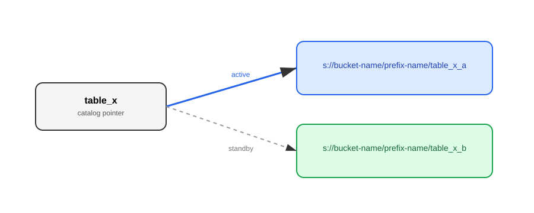

<h2>Motivation</h2>

Teachings on ACID transactions generally focus on the application developer’s perspective. The canonical examples of ACID transactions in any beginner level education material often include banking or e-commerce use cases. Furthermore, application developers almost exclusively interface with Online **Transaction** Processing (OLTP) databases and, therefore, can take ACID-compliance for granted. Educational material is usually surface level as a result.
<br>
<br>
ACID transactions are foundational to data integrity. However, they slow down the process of reading and writing data, and add complexity to the underlying data management system. As a result, data engineers often interface with systems that _relax ACID constraints in order to boost performance, scale, and flexibility_. Meanwhile, the same distributed systems that help scale data also lead to higher likelihood of component failures that could compromise data integrity. Therefore, data engineers should have an advanced understanding of ACID transactions in order to scale pipelines while ensuring data integrity.

<h2>Overview</h2>

A database **transaction** is a logical unit of work that contains one or more SQL statements.

**ACID (Atomicity, Consistency, Isolation, Durability) properties** of database transactions guarantee validity of data, even in the event of errors / failures while the transaction runs, and after it completes.

**Atomicity**

- The whole transaction is processed or nothing is processed (i.e. revert database back to original state if transaction cannot complete).

**Consistency** (i.e. “Correctness”)

- Enforces database constraints.
- Prevents database corruption by an illegal transaction.
- Consistent transaction takes database from one valid state to another valid state, enforcing all defined rules.

**Isolation**

- Multiple transactions can execute concurrently and safely.
- Isolation ensures that concurrent execution of transactions leaves the database in the same state that would have been obtained if the transactions were executed sequentially.
- The intermediate states between the steps of a transaction are not visible to other concurrent transactions.
- All changes within a transaction become visible simultaneously.

**Durability**

- Transactions are saved to non-volatile memory.
- Guarantees that once a transaction is completed and acknowledged by DBMS, it has indeed been permanently recorded and won’t be lost even if a crash ensues shortly after.
- A durable transaction guarantees that all updates made by a transaction are logged in permanent storage (i.e. on disk) before the transaction is reported complete.

<h2>Deep Dive with Examples</h2>

<h3>Example 1:</h3>

Consistency enforces constraints and constraints are defined when creating tables.

```sql
CREATE TABLE users (
  name VARCHAR(255) NOT NULL, /*datatype and NOT NULL constaints on 'name' column*/
  email VARCHAR(255) NOT NULL, /*datatype and NOT NULL constaints on 'email' column*/
  age INT NOT NULL, /*datatype and NOT NULL constaints on 'age' column*/
  UNIQUE KEY unique_email (email) /*uniqueness constraint on 'email' column*/
)
```

Contrary to many online examples, an ACID transaction can be a **single** SQL statement.

```sql
INSERT INTO users (name, email, age)
VALUES
  ('Alice', 'alice@example.com', 30),
  ('Bob', 'bob@example.com', 27),
  ('Carol', 'carol@example.com', 35);
```

Even a simple `INSERT` statement is implicitly executed as a transaction in a DBMS, such as MySQL. Most DBMS client libraries will automatically wrap a SQL statement input in a transaction as so:

```sql
START TRANSACTION;

INSERT INTO users (name, email, age)
VALUES
  ('Alice', 'alice@example.com', 30),
  ('Bob', 'bob@example.com', 27),
  ('Carol', 'carol@example.com', 35);

COMMIT;
```

How do ACID properties apply to the simple `INSERT` statement provided?

**Atomicity** -> Either all three records (Alice / Bob / Carol) will be inserted or none of them will be inserted. <br>
**Consistency** -> All constraints must be satisfied in order for the transaction to complete. E.g. "alice\@gmail.com" must be unique to users table and therefore cannot already exist in users table in order for the transaction to complete. <br>
**Isolation** -> Any other transaction executing concurrently will not be able to read or update the three records, until the `INSERT` transaction is complete. <br>
**Durable** -> Once the transaction completes and the client receives a success message, the client can be certain that the three records have been saved to disk. Even if the DBMS is rebooted, those three records will persist. Alternatively, if the client library receives a failure message, it can be certain that none of those three records will persist.

It’s important for data engineers to understand the consequences of ACID properties (or **lack-thereof**) on even a single `INSERT` statement. What if one needs to write data processing code on a node that cannot reliably interface with a database server? What if the node only had a file to insert data into? Even for a very basic `INSERT` statement it would require overhead application logic to ensure data integrity without passing that responsibility off to an ACID-compliant DBMS.

<h3>Example 2:</h3>

```sql
CREATE TABLE users (
  name VARCHAR(255) NOT NULL,
  email VARCHAR(255) NOT NULL,
  age INT NOT NULL,
  UNIQUE KEY unique_email (email)
);

CREATE TABLE fact_sales (
  sale_id BIGINT UNSIGNED AUTO_INCREMENT PRIMARY KEY,
  user_email VARCHAR(255) NOT NULL,
  product_id INT NOT NULL,
  quantity_purchased INT UNSIGNED NOT NULL,
  date DATE NOT NULL,

  CONSTRAINT fk_fact_sales_user
  FOREIGN KEY (user_email)
  REFERENCES users(email)
);
```

Multiple SQL statements executed as a single transaction is called a **transaction block**.

```sql
START TRANSACTION;

/* SQL statement 1*/
INSERT INTO users (name, email, age)
VALUES
  ("David", "david@example.com", 35);

/* SQL statement 2*/
INSERT INTO fact_sales (user_email, product_id, quantity_purchased, date)
VALUES
  ("david@example.com", 5, 7, 20260101);

COMMIT;
```

Now, imagine an analyst is trying to track the average number of purchases of a product per user in the system. The analyst also wants to include users who have not purchased the product in the average. Their query may look like:

```sql
SELECT
  COALESCE(SUM(fs.quantity_purchased), 0) / COUNT(u.email) AS avg_quantity_product_5_per_user
FROM users u
LEFT JOIN fact_sales fs
ON u.email = fs.user_email AND fs.product_id = 5;
```

ACID properties of the transaction block above ensure that the analyst will calculate a valid average at a particular point-in-time (either before the `INSERT` transaction block started or after it completed/failed).

It’s important to note that ACID-compliance is a spectrum and many analytical systems do not support the full range of ACID properties that application developers may be used to. In order to support a **Star** and **Snowflake** data model, for example, an analytical system must support multi-statement and multi-table ACID transactions, such as the one included in this example.

<h2>Data Lake and Data Lakehouse Examples</h2>

ACID constraints are often relaxed, especially by big data systems, in order to boost performance, scale, and flexibility.

<h3>E.g. Relaxing Isolation</h3>

Isolation is enforced through **pessimistic concurrency control** (i.e. locking of select database objects when in use) or through **optimistic concurrency control** (execute transactions as if there was no contention and only rollback one or more transactions if there was a conflict detected). It should be clear that forgoing Isolation property of a transaction would dramatically increase concurrency. Apache Cassandra is an example of a DBMS that provides no isolation guarantee (beyond a single row), allowing for massive scale in concurrent writes. Lack of strict isolation still makes Cassandra useful for many applications such as storing large amounts of chat messages.

<h3>E.g. Relaxing Durability</h3>

Non-volatile storage is slower to read/write to than volatile storage. In-memory databases, such as Redis, can drop durability guarantees and greatly reduce IO latency of queries.

---

Where data engineers may encounter the gray area of ACID transactions the most is when navigating the spectrum of Data Lake / Data Lakehouse / Data Warehouse.

A Data Warehouse is the original Online Analytical Processing (OLAP) system. It is most similar to conventional SQL-based, ACID-compliant, relational database management systems (RDBMS); but, optimized for analytical workloads (e.g. leveraging column-oriented storage for fast analytical queries instead of row-oriented).

A Data Lake is another OLAP architecture. Data Warehouses and Data Lakes are both optimized for scale. But, relaxing ACID constraints (as a Data Lake does) can also improve flexibility.

<h3>E.g. Relaxing Consistency</h3>

One of the key differences between a Data Lake and Data Warehouse is that the former is _schema-on-read_ and the latter is _schema-on-write_. One can write data to Data Lake without any defined structure. By loosening the Consistency property when writing data one does not need to define schemas up front. This greatly increases flexibility when writing data.

---

A Data Warehouse is built on top of one or more DBMSs that enforce ACID transactions, among many other benefits of a database system. The storage and the compute are coupled. A Data Lake is simply built on top of a distributed file system (such as Amazon S3) and one or more open source file formats (such as orc, parquet, and csv). There is full freedom to the data processing library (such as Spark, Dask, and pandas) and file format that one may choose -- the compute and storage are decoupled.

A Data Lake architecture has many benefits but it pushes many of the responsibilities of ensuring data integrity onto the data engineer. It becomes important for the data engineer to understand some of the primitives of the distributed file system, as a database developer would need to understand when building a database on top of these primitives.

<h3>Example 3:</h3>

An essential workflow in a data pipeline is for one step (Step A) to write data in the form of multiple files to a prefix and for a downstream step (Step B) to read and further process that data — only after the first step is complete.


One common way I see this handled is to have Step A write an empty `__DONE__` (or `__SUCCESS__`) file, under the latest prefix, as its final step in processing data. Step B can watch for the presence of `__DONE__` file before proceeding with downstream processing. Because Amazon s3 is a distributed and eventually consistent (with exceptions) filesystem, there is actually no guarantee that Step B will read the `__DONE__` file **strictly after** all files in its prefix are available to it. Furthermore, there is no guarantee that Step B will comprehensively `LIST` all files written by Step A (unknown unknown). Therefore, there is a non-zero chance that Step B may process incomplete data; although I have never observed this happen before in pipelines where workers and data exist in the same AWS region.

AWS S3’s **strong read-after-write consistency** is an exception to its predominant eventually consistent behavior. [“If a PUT request is successful, your data is safely stored. Any read (GET or LIST request) that is initiated following the receipt of a successful PUT response will return the data written by the PUT request.”](https://docs.aws.amazon.com/AmazonS3/latest/userguide/Welcome.html#ConsistencyModel) Therefore, if Step A and Step B are executed by the same client/process then Step B can be guaranteed to read all of Step A’s writes (i.e. read complete data); but, Step A and Step B are often executed by different workers spun up concurrently.

If data completeness is of paramount importance then it can be achieved with a `__MANIFEST__` file. Instead of simply signaling to Step B that Step A is complete with an empty `__DONE__` file, a `__MANIFEST__` file can both signal to Step B that Step A is complete and list all files it must read in the prefix. Updates to single keys in S3 are **atomic**. Therefore, there is zero chance of Step B reading a partially written `__MANIFEST__` file and thus reading a partial list of files it must consume. Logic can be written in Step B (such as retries) to handle cases where a file name listed in `__MANIFEST__` is not yet available for it to read.

<h3>Example 4:</h3>

Write-once and read-many workloads are extremely common in OLAP. Write operations can be very lengthy for big tables, on the order of minutes and even hours. It would be very painful to interrupt readers for the entire duration of writes. How can we ensure read concurrency and atomic writes in a Data Lake? One must maintain two or more versions of the table at a time. Readers can consume an old version of a table while a new version is being written in isolation. This is akin to a blue-green deployment in CICD.



Assume `s://bucket-name/prefix-name/table_x_a` is the newest version. When updating table_x, the writer can delete and overwrite `s://bucket-name/prefix-name/table_x_b` while readers are reading from `s://bucket-name/prefix-name/table_x_a`. When `s://bucket-name/prefix-name/table_x_b` is complete, the writer can switch the catalog pointer of table_x from `s://bucket-name/prefix-name/table_x_a` to `s://bucket-name/prefix-name/table_x_b`. The catalog table_x is only unavailable for the tiny duration it takes to switch the pointer.

The DBIO transactional commit protocol, enabled by default for Spark in Databricks, ensures atomic table writes with a similar approach:

<a href="https://www.databricks.com/blog/2017/05/31/transactional-writes-cloud-storage.html">

When a user writes a file in a job, DBIO will perform the following actions for you.

- Tag files written with the unique transaction id.
- Write files directly to their final location.
- Mark the transaction as committed when the jobs commits.

When a user goes to read the files, DBIO will perform the following actions for you.

- Check to see if it has a transaction id as well as a status and either ignore files if the transaction has not completed or read in your data.

</a>

<h3>Example 5:</h3>

It turns out transactions are vital and can be built on top of data lakes. However, more complicated transactions, such as an atomic update to a table, can be unwieldy to perform in the pipeline code. ACID transactions can instead be delegated to special libraries, such as Delta Lake, Apache Hudi, or Apache Iceberg.

Referring back to the users table, consider the scenario where you may want to increment the age of all users who recently had a birthday.

```sql
UPDATE users
SET age = age + 1
WHERE name IN ('Alice', 'Carol');
```

Transactionally updating a table, without completely overwriting it, is much more challenging. It requires maintaining and tracking multiple versions of the select objects that need to be updated. Luckily, libraries such as [Delta Lake](https://docs.delta.io/delta-update/), will handle this for you.

Utilization of these libraries in your architecture transforms your Data Lake into a hybrid Data Lake**house**.

It is worthwhile to dive into the plethora of resources online to understand how Delta Lake performs ACID transactions. At a very high level, I will point out here that Delta Lake will maintain a transaction log (`_delta_log`) for each delta table that lives alongside the raw data objects. This transaction log tracks the object names of the latest version(s) of the table. The Delta Lake internals relies heavily on “put-if-absent” filesystem primitive of s3 to ensure a client can overwrite `_delta_log` atomically and even [concurrently](https://docs.delta.io/concurrency-control/) (if there happens to be multiple clients trying to update a table at once).

However, cloud object stores, such as s3, do not provide primitives to write multiple files atomically. Therefore, multiple `_delta_log` objects cannot be atomically written as a batch and consequentially multi-table transactions (e.g. Example 2) are problematic.

Delta 4.0 is required to perform multi-statement and multi-table transactions with a feature called “Coordinated Commits” (available in Preview only as of 2026-01-27).

["The updated Delta Lake commit protocol enables reliable multi-cloud and multi-engine writes that do not rely on the filesystem to provide commit atomicity. Users can designate a 'Commit Coordinator' for their Delta tables which will manage all writes to the table. The 'Commit Coordinator' coordinates concurrent writes from different clusters and ensures that readers get the freshest table version. This release comes with a DynamoDB Commit Coordinator. This change also paves the way for multi-statement and multi-table transactions by introducing a centralized coordinator for writes to a Delta table."](https://delta.io/blog/delta-lake-4-0/#coordinated-commits-available-in-preview)

While cool, adopting an external DBMS as a “Commit Coordinator” is a strong move away from sole filesystem reliance for data storage. It is a coupling of the storage and compute layer that pushes the architecture beyond Data Lakehouse and into Data Warehouse category.

[def]: https://www.databricks.com/blog/2017/05/31/transactional-writes-cloud-storage.html
