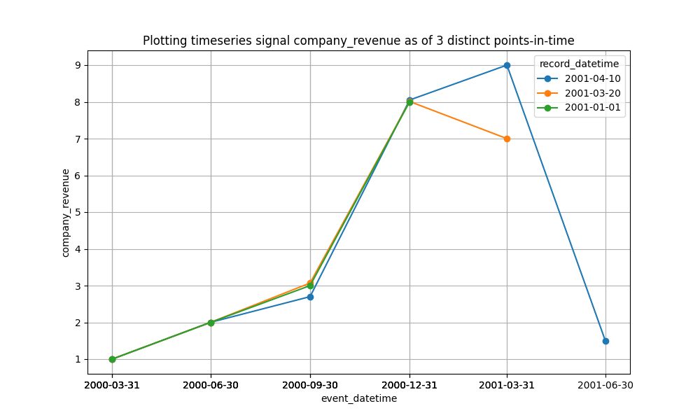

## Table of Contents

- [Overview](#overview)
- [Example Point-in-Time Timeseries Dataset](#example-point-in-time-timeseries-dataset)
- [Importance of Point-in-Time for Alternative Data](#importance-of-point-in-time-for-alternative-data)
- [Methodoligies](#methodologies)
- [Deeper Dive](#deeper-dive)
  - [Hist Snapshots](#histsnapshots)
  - [Type 2 SCD](#type2scd)
    - [Data model](#data-model)
    - [Query Type2 SCD for view of dataset at point in time T](#query-type2-scd-for-view-of-dataset-at-point-in-time-t)
    - [Query Type2 SCD for latest/current view of dataset](#query-type2-scd-for-latestcurrent-view-of-dataset)
    - [Query Type2 SCD for changes between two points in time (T1 and T2)](#query-type2-scd-for-changes-between-two-points-in-time-t1-and-t2)
    - [Parse NetChanges for 'Updates' given 'Primary Key'](#parse-netchanges-for-updates-given-primary-key)
    - [Query Type2 SCD for any new value(s) for a particular dimension](#query-type2-scd-for-any-new-values-for-a-particular-dimension)
    - [Join multiple Type2SCD tables into a single unified Type2SCD](#join-multiple-type2scd-tables-into-a-single-unified-type2scd)
    - [Merge latest/current version into Type2SCD](#merge-latestcurrent-version-into-type2scd)

## Overview

"Point-in-time" is a property of a dataset that describes its preservation of historical states, providing the ability to query the past and retreive data "as of" a certain date and time. <br>

- When (YYYY-MM-DDThh:mm:ss) was information known/recorded? <br>
- What information was known at a certain datetime (YYYY-MM-DDThh:mm:ss)? <br>

<br>
Point-in-time is valuable for auditing/compliance, reproduceability (did results change due to change in methodology or change in data?), and in order to eliminate look-ahead bias when modelling and performing backtesting. It is critically important when evaluating a trading strategy on historical data that your strategy does not incorporate data that would not actually have been available at the point-in-time a trade is simulated.<br>
<br>

## Example Point-in-Time Timeseries Dataset

Recording timeseries data point-in-time can be tricky to wrap one's head around. Timeseries signals have an `event_datetime` attribute. This attribute is part of the record (i.e. raw data) itself and to be differentiated from point-in-time metadata such as `record_datetime`, `commit_datetime`, `record_from`, and `record_to`.



- As of 2001-01-01 we did not have company revenue data for 2001 Q1 (of course)
- As of 2001-03-20, we did have some incomplete company revenue data for 2001 Q1
- As of 2001-04-10, we had complete company revenue data for 2001 Q1

<br>
If this dataset was stored under the hood in Historical Snapshot (further explained in subsequent sections) form it would look as such:
<br>
<br>

<table>
  <thead>
    <tr>
      <th>company_revenue</th>
      <th>event_datetime</th>
      <th>record_datetime</th>
    </tr>
  </thead>
  <tbody>
    <tr style="color: green;"><td>1</td><td>2000-03-31</td><td>2001-01-01</td></tr>
    <tr style="color: green;"><td>2</td><td>2000-06-30</td><td>2001-01-01</td></tr>
    <tr style="color: green;"><td>3</td><td>2000-09-30</td><td>2001-01-01</td></tr>
    <tr style="color: green;"><td>8</td><td>2000-12-31</td><td>2001-01-01</td></tr>
    <tr style="color: green;"><td>NULL</td><td>2001-03-31</td><td>2001-01-01</td></tr>
    <tr style="color: orange;"><td>1</td><td>2000-03-31</td><td>2001-03-20</td></tr>
    <tr style="color: orange;"><td>2</td><td>2000-06-30</td><td>2001-03-20</td></tr>
    <tr style="color: orange;"><td>3.07</td><td>2000-09-30</td><td>2001-03-20</td></tr>
    <tr style="color: orange;"><td>8.01</td><td>2000-12-31</td><td>2001-03-20</td></tr>
    <tr style="color: orange;"><td>7</td><td>2001-03-31</td><td>2001-03-20</td></tr>
    <tr style="color: blue;"><td>1</td><td>2000-03-31</td><td>2001-04-10</td></tr>
    <tr style="color: blue;"><td>2</td><td>2000-06-30</td><td>2001-04-10</td></tr>
    <tr style="color: blue;"><td>2.7</td><td>2000-09-30</td><td>2001-04-10</td></tr>
    <tr style="color: blue;"><td>8.05</td><td>2000-12-31</td><td>2001-04-10</td></tr>
    <tr style="color: blue;"><td>9</td><td>2001-03-31</td><td>2001-04-10</td></tr>
    <tr style="color: blue;"><td>1.5</td><td>2001-06-30</td><td>2001-04-10</td></tr>
  </tbody>
</table>

A non-PIT dataset would simply include only the latest/current view, as such:

<table>
  <thead>
    <tr>
      <th>company_revenue</th>
      <th>event_datetime</th>
    </tr>
  </thead>
  <tbody>
    <tr style="color: blue;"><td>1</td><td>2000-03-31</td></tr>
    <tr style="color: blue;"><td>2</td><td>2000-06-30</td></tr>
    <tr style="color: blue;"><td>2.7</td><td>2000-09-30</td></tr>
    <tr style="color: blue;"><td>8.05</td><td>2000-12-31</td></tr>
    <tr style="color: blue;"><td>9</td><td>2001-03-31</td></tr>
    <tr style="color: blue;"><td>1.5</td><td>2001-06-30</td></tr>
  </tbody>
</table>

## Importance of Point-in-Time for Alternative Data

["Importance of Point-in-Time for Alternative Data"](https://www.eaglealpha.com/2024/05/06/point-in-time-alternative-data/) by Mikheil Shengelia does a very thorough job of explaining the importance of point-in-time data in finance. Some select quotes from the blog include:

- "PIT data, marked with the date of a company’s disclosure, preserves the accuracy of historical data by avoiding biases from subsequent revisions. Conversely, non-PIT data often replaces original figures due to updates or errors and is usually marked by the fiscal period’s end."
- "The 5 scenarios in which PIT data is crucial for investors highlighted in our recent report are 1) CEO change announcements over various stage, 2) M&A-related data at various stages of the M&A cycle, 3) Clinical trials and FDA approval, 4) Earnings release dates and updates (by companies and by data vendors, and 5) Fiscal period end dates."
- "[S&P Capital IQ](https://www.spglobal.com/content/dam/spglobal/mi/en/documents/general/sp-capitaliq-quantamental-point-in-time-vs-lagged-fundamentals.pdf) notes that while time lags can be applied to non-PIT data to reduce biases, this can lead to inconsistencies due to varying filing times and regulations globally. Their research highlights the challenges in using time lags to simulate PIT data, emphasizing the complexities of accurately representing financials as they were known at the original reporting time."

A key part of an financial analyst's job is performing intra-quarter analysis. If they want to use alternative data to estimate quarterly fundamentals (e.g. profit, revenue, etc.), before quarter-end, they will necessarily have to deal with incomplete data.

Introducing more terminology:

**fill delay:** number of days between the date of a data point generated, e.g. transaction happened, and the date of the data record delivered
<br>

**fill rate:** percentage of data filled for a period at a certain time

Estimating quarter-end KPI requires calculating fill rate at the given time the estimate is made. [S&P Capital IQ](https://www.spglobal.com/content/dam/spglobal/mi/en/documents/general/sp-capitaliq-quantamental-point-in-time-vs-lagged-fundamentals.pdf) details the issues of doing so without point-in-time data.

## Methodologies

#### Historical Snapshots vs. Type 2 SCD

<br>
The naive method to provide point-in-time data is to simply snapshot the dataset everytime a change is made. This would not be practical for a transactional table where small changes are made frequently. For a data warehouse, it would be suboptimal.
<br>
<br>
The optimized method is to adopt a Type 2 SCD data model. Slowly Changing Dimensions (SCD) are a data warehousing technique introduced by Ralph Kimball. The technique derives its name from its original application to the Dimension tables in a Star or Snowflake Schema. Type 2 SCD is the commonly used variation of the technique that preserves the full history of values of a dimension table.
<br>
<br>

Ironically, I would not recommend SCD modelling for its original application of Dimension tables. In ["Functional Data Engineering -- a modern paradigm for batch data processing"](https://maximebeauchemin.medium.com/functional-data-engineering-a-modern-paradigm-for-batch-data-processing-2327ec32c42a), Maxime Beauchemin advocates against using SCD modeling because the headache of using it in his opinion (and mutating data) is not worth the reduction in storage size because storage is cheap. He recommends dimension snapshots (the naive method). Maxime's experienced viewpoint is correct for many applications. However, there are applications where the dataset is so large that snapshotting the dataset frequently is cost-prohibitive. Storage is cheap, but not free. In finance, I have encountered many snapshotted timeseries datasets of hundreds of terabytes in size. Switching to Type 2 SCD model compressed the datasets by orders of magnitude. Besides reduction in storage size, Type 2 SCD has other benefits. For example, when iterating through a "point-in-time" dataset during backtesting, static records (records that do not change across versions) do not need to be reloaded into memory.
<br>
<br>
Type 2 SCD modelling provides efficiency at the expense of complexity in many operations including:

- upserting data
- querying data
- joining data

It is important when adopting this model that it is standardized across your department so that common utilities can be written to hide this complexity to both maintainers and end-users of the point-in-time dataset.

## Deeper Dive

For a deeper dive on important Type 2 SCD modelling and behavior, a simplified dataset is used. Metadata values provided are in date format, however, queries would function identically with datetime formatted values.

### HistSnapshots

<h4>Table Version 0</h4>
<table>
  <thead>
    <tr>
      <th>column_x</th>
      <th>column_y</th>
      <th>record_datetime</th>
    </tr>
  </thead>
  <tbody>
    <tr style="color: gray;">
      <td>a</td>
      <td>1</td>
      <td>2000-01-01</td>
    </tr>
    <tr style="color: green;">
      <td>b</td>
      <td>1</td>
      <td>2000-01-01</td>
    </tr>
    <tr style="color: blue;">
      <td>c</td>
      <td>NULL</td>
      <td>2000-01-01</td>
    </tr>
  </tbody>
</table>

<h4>Table Version 1</h4>
<table>
  <thead>
    <tr>
      <th>column_x</th>
      <th>column_y</th>
      <th>record_datetime</th>
    </tr>
  </thead>
  <tbody>
    <tr style="color: red;">
      <td>a</td>
      <td>0</td>
      <td>2000-01-02</td>
    </tr>
    <tr style="color: green;">
      <td>b</td>
      <td>1</td>
      <td>2000-01-02</td>
    </tr>
    <tr style="color: purple;">
      <td>d</td>
      <td>2</td>
      <td>2000-01-02</td>
    </tr>
  </tbody>
</table>

<h4>Table Version 2</h4>
<table>
  <thead>
    <tr>
      <th>column_x</th>
      <th>column_y</th>
      <th>record_datetime</th>
    </tr>
  </thead>
  <tbody>
    <tr style="color: red;">
      <td>a</td>
      <td>0</td>
      <td>2000-01-05</td>
    </tr>
    <tr style="color: green;">
      <td>b</td>
      <td>1</td>
      <td>2000-01-05</td>
    </tr>
    <tr style="color: blue;">
      <td>c</td>
      <td>NULL</td>
      <td>2000-01-05</td>
    </tr>
    <tr style="color: purple;">
      <td>d</td>
      <td>2</td>
      <td>2000-01-05</td>
    </tr>
  </tbody>
</table>

<h4>Table Version 3</h4>
<table>
  <thead>
    <tr>
      <th>column_x</th>
      <th>column_y</th>
      <th>record_datetime</th>
    </tr>
  </thead>
  <tbody>
    <tr style="color: gray;">
      <td>a</td>
      <td>1</td>
      <td>2000-01-07</td>
    </tr>
    <tr style="color: green;">
      <td>b</td>
      <td>1</td>
      <td>2000-01-07</td>
    </tr>
    <tr style="color: orange;">
      <td>c</td>
      <td>3</td>
      <td>2000-01-07</td>
    </tr>
    <tr style="color: purple;">
      <td>d</td>
      <td>2</td>
      <td>2000-01-07</td>
    </tr>
  </tbody>
</table>

Create table of historical snapshots of dataset over time:

```sql
CREATE TABLE HistSnapshots(
    column_x VARCHAR(10) NULL,
    column_y INT NULL,
    record_datetime DATE NOT NULL,
    version INT NOT NULL
);
INSERT INTO HistSnapshots(column_x, column_y, record_datetime, version) VALUES
('a', 1, '2000-01-01', 0),
('b', 1, '2000-01-01', 0),
('c', NULL, '2000-01-01', 0),
('a', 0, '2000-01-02', 1),
('b', 1, '2000-01-02', 1),
('d', 2, '2000-01-02', 1),
('a', 0, '2000-01-05', 2),
('b', 1, '2000-01-05', 2),
('c', NULL, '2000-01-05', 2),
('d', 2, '2000-01-05', 2),
('a', 1, '2000-01-07', 3),
('b', 1, '2000-01-07', 3),
('c', 3, '2000-01-07', 3),
('d', 2, '2000-01-07', 3);
```

### Type2SCD

<table>
  <thead>
    <tr>
      <th>column_x</th>
      <th>column_y</th>
      <th>record_from</th>
      <th>record_to</th>
    </tr>
  </thead>
  <tbody>
    <tr style="color: gray;">
      <td>a</td>
      <td>1</td>
      <td>2000-01-01</td>
      <td>2000-01-02</td>
    </tr>
    <tr style="color: gray;">
      <td>a</td>
      <td>1</td>
      <td>2000-01-07</td>
      <td>9999-12-31</td>
    </tr>
    <tr style="color: red;">
      <td>a</td>
      <td>0</td>
      <td>2000-01-02</td>
      <td>2000-01-07</td>
    </tr>
    <tr style="color: green;">
      <td>b</td>
      <td>1</td>
      <td>2000-01-01</td>
      <td>9999-12-31</td>
    </tr>
    <tr style="color: blue;">
      <td>c</td>
      <td>NULL</td>
      <td>2000-01-01</td>
      <td>2000-01-02</td>
    </tr>
    <tr style="color: blue;">
      <td>c</td>
      <td>NULL</td>
      <td>2000-01-05</td>
      <td>2000-01-07</td>
    </tr>
        <tr style="color: orange;">
      <td>c</td>
      <td>3</td>
      <td>2000-01-05</td>
      <td>9999-12-31</td>
    </tr>
    <tr style="color: purple;">
      <td>d</td>
      <td>2</td>
      <td>2000-01-02</td>
      <td>9999-12-31</td>
    </tr>
  </tbody>
</table>

Create table of dataset over time in compressed Type2SCD form:

```sql
CREATE TABLE Type2SCD(
    column_x VARCHAR(10) NULL,
    column_y INT NULL,
    record_from DATE NOT NULL,
    record_to DATE NOT NULL
);
INSERT INTO Type2SCD (column_x, column_y, record_from, record_to) VALUES
('a', 1, '2000-01-01', '2000-01-02'),
('a', 1, '2000-01-07', '9999-12-31'),
('a', 0, '2000-01-02', '2000-01-07'),
('b', 1, '2000-01-01', '9999-12-31'),
('c', NULL, '2000-01-01', '2000-01-02'),
('c', NULL, '2000-01-05', '2000-01-07'),
('c', 3, '2000-01-07', '9999-12-31'),
('d', 2, '2000-01-02', '9999-12-31');
```

#### Data model:

- `record_from` is the datetime at which record was observed in dataset.
- `record_to` is the datetime at which record was deleted from dataset (rather then the datetime at which record was last observed in dataset). <br>
  Therefore, when filtering for a view of the dataset as of some point in time:

```sql
record_from <= @AS_OF_DATETIME AND record_to > @AS_OF_DATETIME
```

This nuance handles gaps of time between snapshots. One can query the Type2SCD table as of '2000-01-03' and retrieve the view of the underlying table as
it existed on that date, even though no changes were made to the underlying table as of '2000-01-03' and thus no snapshots were taken. <br>
More info: https://stackoverflow.com/questions/20005950/best-practice-for-scd-date-pairs-closing-opening-timestamps

- How to handle schema changes? Schema of Type2SCD should be a superset of all schemas across all versions of the underlying dataset.
  - If a columnn is added to underlying dataset then a column should be added to the Type2SCD. The Type2SCD should backfill `NULL` in the added column for all records that were recorded before the column was added.
  - If a colummn is removed from the underlying dataset then that column will still persist in Type2SCD. The Type2SCD should fill `NULL` in removed column for all records that are recorded going forward.

#### Query Type2 SCD for view of dataset at point in time T:

```sql
SELECT *
FROM Type2SCD
WHERE
record_from <= @T AND record_to > @T
```

#### Query Type2 SCD for latest/current view of dataset:

```sql
SELECT *
FROM Type2SCD
WHERE
record_to = '9999-12-31' //'9999-12-31T23:59:59z' if using date and time
```

- additional Boolean column named `is_latest` or `is_valid` is common in practice but is purely for convenience and provides no additional information.

#### Query Type2 SCD for changes between two points in time (T1 and T2):

```sql
WITH CTE_after AS (
  SELECT *
  FROM Type2SCD
  WHERE
  record_from <= @T2 AND record_to > @T2 -- filter for T2 snapshot
  AND
  record_from > @T1 -- filter out records that also exist in T1 snapshot to speed up downstream join operation
), CTE_before AS (
  SELECT *
  FROM Type2SCD
  WHERE
  record_from <= @T1 AND record_to > @T1 -- filter for T1 snapshot
  AND
  record_to <= @T2 -- filter out records that also exist in T2 snapshot to speed up downstream join operation
), NetChanges AS (
  SELECT
    a.column_x, a.column_y, a.record_from AS record_datetime, 'Insert' AS change_type
  FROM CTE_after a
  LEFT JOIN CTE_before b
    ON a.column_x <=> b.column_x -- NULL safe join
    AND a.column_y <=> b.column_y -- NULL safe join
  WHERE b.column_x IS NULL AND b.column_y IS NULL
  UNION ALL -- no need for union because there cannot be duplicates
  SELECT
    b.column_x, b.column_y, b.record_to AS record_datetime, 'Delete' AS change_type
  FROM CTE_before b
  LEFT JOIN CTE_after a
  ON a.column_x <=> b.column_x -- NULL safe join
  AND a.column_y <=> b.column_y -- NULL safe join
  WHERE a.column_x IS NULL AND a.column_y IS NULL
) SELECT *
FROM NetChanges
```

#### Parse NetChanges for 'Updates' given 'Primary Key':

```sql
-- Query assumes guardrails in place to ensure column_x is valid Primary Key (i.e. unique to underlying table)
WITH CTE AS (
  SELECT
  column_x, -- Primary Key
  column_y,
  COUNT(*) OVER(PARTITION BY column_x) AS primary_key_count,
  record_datetime,
  change_type
FROM NetChanges
) SELECT
  column_x, -- Primary Key
  column_y,
  record_datetime,
  CASE
      WHEN (primary_key_count = 2 AND change_type = 'Insert') THEN 'Update_Postimage'
      WHEN (primary_key_count = 2 AND change_type = 'Delete') THEN 'Update_Preimage'
      ELSE change_type
  END AS change_type
FROM CTE
```

#### Query Type2 SCD for any new value(s) for a particular dimension:

- e.g. any new drugs added or removed in the latest version of claims dataset?
- e.g. any new customers added or removed in the latest version of sales dataset?

```sql
WITH CTE_after AS (
  SELECT column_x
  FROM Type2SCD
  WHERE
  record_from <= @T2 AND record_to > @T2 -- filter for T2 snapshot
), CTE_before AS (
  SELECT column_x
  FROM Type2SCD
  WHERE
  record_from <= @T1 AND record_to > @T1 -- filter for T1 snapshot
), NetAdditions AS (
  SELECT DISTINCT column_x
  FROM CTE_after
  EXCEPT
  SELECT DISTINCT column_x
  FROM CTE_before
), NetDeletions AS (
  SELECT DISTINCT column_x
  FROM CTE_before
  EXCEPT
  SELECT DISTINCT column_x
  FROM CTE_after
)
SELECT column_x, 'Added' AS status
FROM NetAdditions
UNION
SELECT column_x, 'Deleted' AS status
FROM NetDeletions
```

#### Join multiple Type2SCD tables into a single unified Type2SCD:

```sql
-- Drop and recreate scd2_table1
DROP TABLE IF EXISTS scd2_table1;
CREATE TABLE scd2_table1 (
    pk VARCHAR(255),
    dim1 VARCHAR(255),
    record_from DATE,
    record_to DATE
);

INSERT INTO scd2_table1 (pk, dim1, record_from, record_to) VALUES
    ('pk', 'dim1-a', '2023-01-01', '2023-01-03'),
    ('pk', 'dim1-b', '2023-01-03', '2023-01-04'),
    ('pk', 'dim1-c', '2023-01-04', '2023-01-07'),
    ('pk', 'dim1-d', '2023-01-07', '2023-01-09'),
    ('pk', 'dim1-e', '2023-01-09', '9999-12-31');

-- Drop and recreate scd2_table2
DROP TABLE IF EXISTS scd2_table2;
CREATE TABLE scd2_table2 (
    pk VARCHAR(255),
    dim2 VARCHAR(255),
    record_from DATE,
    record_to DATE
);

INSERT INTO scd2_table2 (pk, dim2, record_from, record_to) VALUES
    ('pk', 'dim2-a', '2022-12-31', '2023-01-02'),
    ('pk', 'dim2-b', '2023-01-02', '2023-01-04'),
    ('pk', 'dim2-c', '2023-01-04', '2023-01-06'),
    ('pk', 'dim2-d', '2023-01-06', '9999-12-31');

-- Drop and recreate scd2_table3
DROP TABLE IF EXISTS scd2_table3;
CREATE TABLE scd2_table3 (
    pk VARCHAR(255),
    dim3 VARCHAR(255),
    record_from DATE,
    record_to DATE
);

INSERT INTO scd2_table3 (pk, dim3, record_from, record_to) VALUES
    ('pk', 'dim3-a', '2023-01-01', '2023-01-03'),
     -- gap between 2023-01-03 and 2023-01-05
     -- which is fine, table_3 was empty between 2023-01-03 and 2023-01-05
     -- which will be properly reflected in join query
    ('pk', 'dim3-b', '2023-01-05', '2023-01-07'),
    ('pk', 'dim3-c', '2023-01-07', '9999-12-31');

WITH
    -- create unified timeline based on all record_from values
    -- from referenced Type2SCD tables
    unified_timeline AS (
        -- using union to deal with duplicates values instead of union all
        SELECT pk, record_from FROM scd2_table1 UNION
        SELECT pk, record_from FROM scd2_table2 UNION
        SELECT pk, record_from FRoM scd2_table3
    ),
    unified_timeline_recalculate_record_to AS (
        SELECT
            pk,
            record_from,
            COALESCE(LEAD(record_from) OVER(PARTITION BY pk ORDER BY record_from), '9999-12-31') AS record_to
        FROM unified_timeline
    ),
    joined AS (
        SELECT
            timeline.pk,
            scd2_table1.dim1,
            scd2_table2.dim2,
            scd2_table3.dim3,
            timeline.record_from AS record_from,
            timeline.record_to AS record_to
        FROM unified_timeline_recalculate_record_to AS timeline
        LEFT JOIN scd2_table1
            ON timeline.pk = scd2_table1.pk
            AND scd2_table1.record_from <= timeline.record_from
            AND scd2_table1.record_to >= timeline.record_to
        LEFT JOIN scd2_table2
            ON timeline.pk = scd2_table2.pk
            AND scd2_table2.record_from <= timeline.record_from
            AND scd2_table2.record_to >= timeline.record_to
        LEFT JOIN scd2_table3
            ON timeline.pk = scd2_table1.pk
            AND scd2_table3.record_from <= timeline.record_from
            AND scd2_table3.record_to >= timeline.record_to

    )
--  SELECT * FROM unified_timeline_recalculate_record_to
SELECT * FROM joined
-- where record_from != record_to -- As we already have a distinct timeline (using union), this condition is no longer needed
ORDER BY PK, record_from, record_to, dim1, dim2, dim3
;
```

More info: https://infinitelambda.com/multitable-scd2-joins/

#### Merge latest/current version into Type2SCD:

- latest record(s) match previous record(s) (i.e. Table Version 4 record(s) match Table Version 3 record(s)) -> do nothing
- latest record(s) not in previous record set -> insert latest record(s) with new `record_from`
- previous record(s) not in latest record set -> soft delete previous record(s) (update `record_to`)

<h4>Table Version 4 (Latest)</h4>
<table>
  <thead>
    <tr>
      <th>column_x</th>
      <th>column_y</th>
      <th>record_datetime</th>
    </tr>
  </thead>
  <tbody>
    <tr style="color: black;">
      <td>a</td>
      <td>8</td>
      <td>2000-01-10</td>
    </tr>
    <tr style="color: green;">
      <td>b</td>
      <td>1</td>
      <td>2000-01-10</td>
    </tr>
    <tr style="color: blue;">
      <td>c</td>
      <td>NULL</td>
      <td>2000-01-10</td>
    </tr>
    <tr style="color: brown;">
      <td>e</td>
      <td>9</td>
      <td>2000-01-10</td>
    </tr>
  </tbody>
</table>

It is critical to perform merge inside of a transaction block to protect integrity of Type2SCD table.

```sql
START TRANSACTION;

SET @run_date = '2000-01-10'; -- can use system datetime or query from Latest

-- 1. Soft delete (invalidate previous record(s) not in Latest)
UPDATE Type2SCD t
LEFT JOIN Latest l
  ON (t.column_x <=> l.column_x AND t.column_y <=> l.column_y) -- NULL-safe equality is critical
SET t.record_to = @run_date
WHERE t.record_to = '9999-12-31' AND (l.column_x IS NULL AND l.column_y IS NULL);

-- 2. Insert new or changed record(s)
INSERT INTO Type2SCD (column_x, column_y, record_from, record_to)
SELECT l.column_x, l.column_y, @run_date, '9999-12-31'
FROM Latest l
LEFT JOIN Type2SCD t
  ON (t.column_x <=> l.column_x AND t.column_y <=> l.column_y) -- NULL-safe equality is critical
 AND t.record_to = '9999-12-31'
WHERE (t.column_x IS NULL AND t.column_y IS NULL);;

COMMIT;
```

<h4>Type2SCD (after Latest merge)</h4>
<table>
  <thead>
    <tr>
      <th>column_x</th>
      <th>column_y</th>
      <th>record_from</th>
      <th>record_to</th>
    </tr>
  </thead>
  <tbody>
    <tr style="color: gray;">
      <td>a</td>
      <td>1</td>
      <td>2000-01-01</td>
      <td>2000-01-02</td>
    </tr>
    <tr style="color: gray;">
      <td>a</td>
      <td>1</td>
      <td>2000-01-07</td>
      <td>2000-01-10</td>
    </tr>
    <tr style="color: red;">
      <td>a</td>
      <td>0</td>
      <td>2000-01-02</td>
      <td>2000-01-07</td>
    </tr>
    <tr style="color: black;">
      <td>a</td>
      <td>8</td>
      <td>2000-01-10</td>
      <td>9999-12-31</td>
    </tr>
    <tr style="color: green;">
      <td>b</td>
      <td>1</td>
      <td>2000-01-01</td>
      <td>9999-12-31</td>
    </tr>
    <tr style="color: blue;">
      <td>c</td>
      <td>NULL</td>
      <td>2000-01-01</td>
      <td>2000-01-02</td>
    </tr>
    <tr style="color: blue;">
      <td>c</td>
      <td>NULL</td>
      <td>2000-01-05</td>
      <td>2000-01-07</td>
    </tr>
    <tr style="color: blue;">
      <td>c</td>
      <td>NULL</td>
      <td>2000-01-10</td>
      <td>9999-12-31</td>
    </tr>
    <tr style="color: orange;">
      <td>c</td>
      <td>3</td>
      <td>2000-01-05</td>
      <td>2000-01-10</td>
    </tr>
    <tr style="color: purple;">
      <td>d</td>
      <td>2</td>
      <td>2000-01-02</td>
      <td>2000-01-10</td>
    </tr>
    <tr style="color: brown;">
      <td>e</td>
      <td>9</td>
      <td>2000-01-10</td>
      <td>9999-12-31</td>
    </tr>
  </tbody>
</table>
